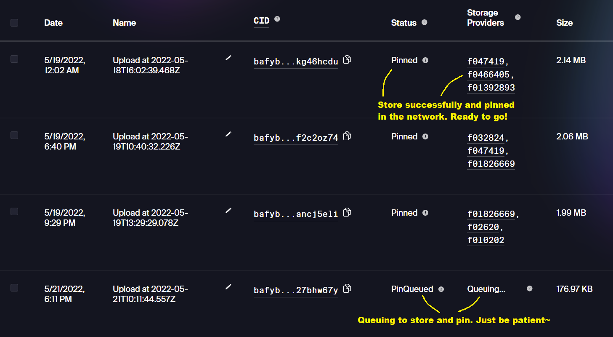
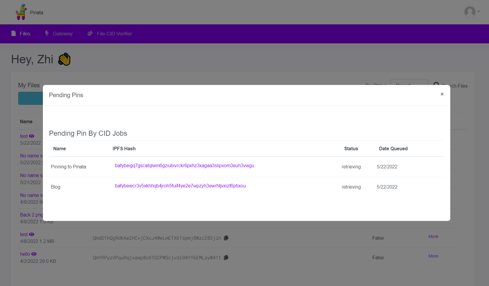
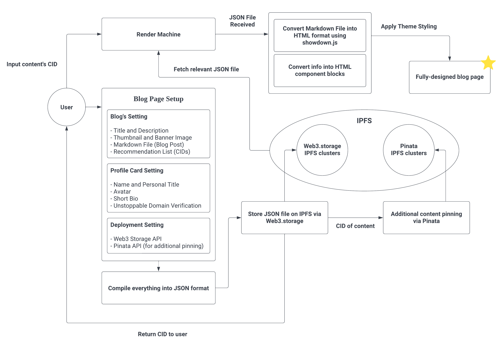

# IPFS Blog Engine ⚡

   

## Synopsis

The **IPFS Blog Engine** and **Render Machine** (built to render blog page from JSON data) serves as the foundation for a Web3.0 blog site and has the ability to scale into a Web3.0 and blockchain-based CMS (Content Management System). It allows users to create a blog page with a simple user interface and then compile all of the blog page's components and uploaded contents into JSON data. The JSON file will then be deployed and stored on the **IPFS (Interplanetary File System)**, which is a distributed file system, with the help of **[Web3.storage](web3.storage)** and **[Pinata](pinata.cloud)**. Users can now render, display and share their blog page simply by utilising the specially-designed Render Machine and the CID obtained when the blog page was created. The required JSON file will be fetched from IPFS and parsed into various components, resulting in a fully-designed blog page. 

#### 🕹️ Live Site | [IPFS Blog Engine](https://ipfs-blog-engine.vercel.app/#/)
#### 🔊 Video Demo | [See how it works](https://drive.google.com/file/d/1P-M23KIuPo2QuRn2khiDmanwuD0WGgAW/view?usp=sharing)
#### ✨ Showcase | [View the deck](https://github.com/Zhixuan0318/IPFS-Blog-Engine/tree/main/pdeck)

## About Testing
⚠️ Sometimes, queuing to pin your generated blog post and make it widely available might take a longer time. No worries! I had generated some sample blog posts, and here are the CIDS: 
* bafybeigjjzu2hwk223mm3zxl35lvrhj2xrzk4sqrh7ce6qd7khancj5eli
* bafybeigjvcch3t2qxixv4mpjwjlbtgfaws6ictwm72wztga26tkg46hcdu
* bafybeiha7gldpsoq2gx6baabwuepm4wmywjwwkbidbk2znlkhrf2c2oz74
* bafybeidwtlkppmshhbunf7rtyn6wjwt2efl6a5w3zsi2mhyyvimc37tke4

⚠️ If you are generating blog post yourself from scratch, check your storing and pinning status on [Web3.storage](web3.storage), make sure it is not queuing and had successfully stored and pinned. Or else, you can't render you blog post as it is not available:

</img>

⚠️ If you are using additional pinning to Pinata, you can always check the `Pin by CID Queue` in Pinata. These are the pending pins in queue: 

</img>

## Application Flow

 
1. Setting up blog page (blog page setting, profile card setting, and deployment setting)
2. When user hits submit, all the info and uploaded contents compiled into a JSON file
3. The JSON file stored on IPFS via [Web3.storage](web3.storage)
4. After [Web3.storage](web3.storage) returned a CID, additional pinning of content (using CID) done via [Pinata](pinata.cloud)
5. The CID obtained from [Web3.storage](web3.storage) returned to the user
5. User can now render the blog page with Render Machine by using the CID
6. The relevant JSON file is fetched from IPFS when user request
7. Markdown file (blog post) converted into HTML format using [Showdown.js](https://github.com/showdownjs/showdown)
8. Other info and contents converted into HTML components.
9. Theme styling is applied and the fully-designed blog page successfully rendered  

