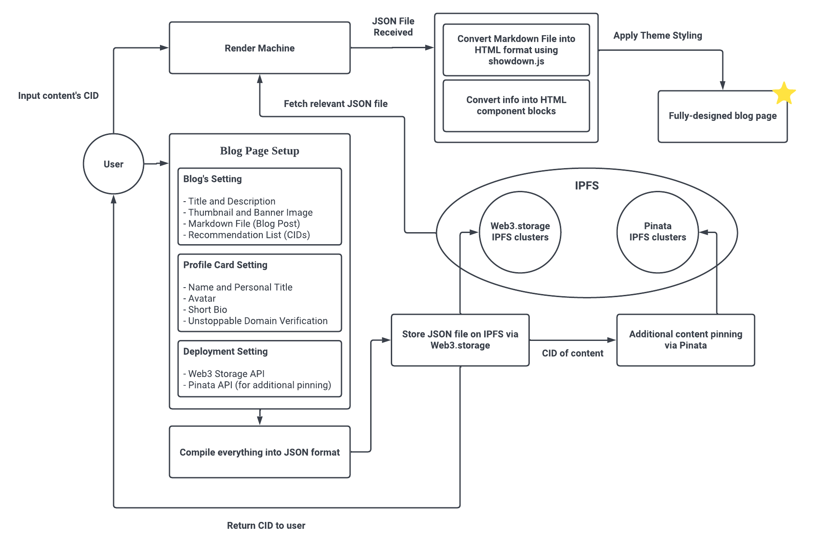

# IPFS Blogging Engine ⚡

## Synopsis

The **IPFS Blogging Engine** and **Render Machine** (built to render blog page from JSON file) serves as the foundation for a Web3.0 blog site and has the ability to scale into a Web3.0 and blockchain-based CMS (Content Management System). It allows users to create a blog page with a simple user interface and then compile all of the blog page's components and uploaded contents into a JSON file. The JSON file will then be deployed and stored on the **IPFS (Interplanetary File System)**, which is a distributed file system, with the help of **[Web3.storage](web3.storage)** and **[Pinata](pinata.cloud)**. Users can now render, display and share their blog page simply by utilising the Render Machine and the CID obtained when the blog page was created. The required JSON file will be fetched from IPFS and parsed into various components, resulting in a fully-designed blog page. 

## Application Flow

 
1. Setting up blog page (blog page setting, profile card setting, and deployment setting)
2. When user hits submit, all the info and uploaded contents compiled into a JSON file
3. The JSON file stored on IPFS via [Web3.storage](web3.storage)
4. After [Web3.storage](web3.storage) returned a CID, additional pinning of content (using CID) done via [Pinata](pinata.cloud)
5. The CID obtained from [Web3.storage](web3.storage) returned to the user
5. User can now render the blog page with Render Machine by using the CID
6. The relevant JSON file is fetched from IPFS when user request
7. Markdown file (blog post) converted into HTML format using [Showdown.js](https://github.com/showdownjs/showdown)
8. Other info and contents converted into HTML components.
9. Theme styling is applied and the fully-designed blog page successfully rendered  

